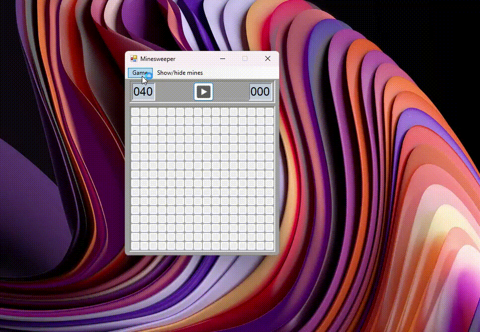

# minesweeper
Minesweeper application developed using WinForms .NET framework.

Image resources taken from https://icons8.com/icons.

## Notes
Minesweeper game developed during early days of learning how to code at university.

Minesweeper-old is the initial WinForms C++ project which is no longer compatible with latest Visual Studio versions.
It works though if is imported into brand new Visual Studio C++ WinForms project and main classes are copied over and Resources re-imported.
Left in history as initial version before rewrite and as a reference implementation (not the cleanest code but fine).

## License

    Copyright 2024 Veaceslav Gaidarji

    Licensed under the Apache License, Version 2.0 (the "License");
    you may not use this file except in compliance with the License.
    You may obtain a copy of the License at

       http://www.apache.org/licenses/LICENSE-2.0

    Unless required by applicable law or agreed to in writing, software
    distributed under the License is distributed on an "AS IS" BASIS,
    WITHOUT WARRANTIES OR CONDITIONS OF ANY KIND, either express or implied.
    See the License for the specific language governing permissions and
    limitations under the License.
